# 🛍️ dbt-Databricks Analytics - Retail Data Warehouse

[](https://docs.getdbt.com)
[](https://databricks.com)

A comprehensive dbt demo project that implements a modern data warehouse for a retail company, following data modeling best practices and medallion architecture patterns.

## 📋 Table of Contents

- [🎯 Project Overview](#-project-overview)
- [🏗️ Architecture](#️-architecture)
- [📊 Data Model](#-data-model)
- [🚀 Setup & Installation](#-setup--installation)
- [📈 dbt Lineage](#-dbt-lineage)
- [🛠️ dbt Commands](#️-dbt-commands)
- [📖 Documentation](#-documentation)

## 🎯 Project Overview

This project demonstrates the implementation of a complete data warehouse for a retail company using dbt (data build tool). The project includes:

- **Medallion Architecture**: Bronze (Raw) → Silver (Staging) → Gold (Marts)
- **Dimensional Modeling**: Facts and dimensions for OLAP analysis
- **Data Quality Tests**: Automated data validations
- **Documentation**: Auto-generated and maintained
- **Business Analytics**: BI-ready insights

### 🎪 Use Cases Covered

- 📊 **Sales Analytics**: Performance metrics by store, product, and employee
- 👥 **Customer Segmentation**: Automated classification based on behavior
- 💰 **Profitability Analysis**: Margin and profitability analysis by dimensions
- 🎯 **Target Achievement**: Comparison against defined targets
- 📈 **Temporal Trends**: Seasonal and temporal pattern analysis

## 🏗️ Architecture

### Medallion Architecture Overview

```mermaid
graph TD
    subgraph Sources ["📥 Data Sources"]
        S1[Raw CSV Files]
        S2[Database Extracts] 
        S3[API Data]
    end
    
    subgraph Bronze ["🥉 Bronze Layer - Raw Data"]
        B1[(customers)]
        B2[(orders)]
        B3[(order_items)]
        B4[(products)]
        B5[(employees)]
        B6[(stores)]
        B7[(suppliers)]
        B8[(dates)]
    end
    
    subgraph Silver ["🥈 Silver Layer - Cleaned Data"]
        C1[stg_customers]
        C2[stg_orders]
        C3[stg_order_items]
        C4[stg_products]
        C5[stg_employees]
        C6[stg_stores]
        C7[stg_suppliers]
        C8[stg_dates]
    end
    
    subgraph Gold ["🥇 Gold Layer - Business Ready"]
        direction TB
        subgraph Dimensions ["📊 Dimensions"]
            D1[dim_customers]
            D2[dim_products] 
            D3[dim_employees]
            D4[dim_stores]
            D5[dim_suppliers]
            D6[dim_dates]
        end
        subgraph Facts ["📈 Facts"]
            F1[fct_orders]
            F2[fct_customer_segmentation]
            F3[fct_store_performance]
        end
    end
    
    Sources --> Bronze
    Bronze --> Silver
    Silver --> Gold
    
    classDef bronze fill:#cd853f,stroke:#8b4513,stroke-width:2px,color:#fff
    classDef silver fill:#c0c0c0,stroke:#696969,stroke-width:2px,color:#000
    classDef gold fill:#ffd700,stroke:#daa520,stroke-width:2px,color:#000
    classDef source fill:#98fb98,stroke:#228b22,stroke-width:2px,color:#000
    
    class B1,B2,B3,B4,B5,B6,B7,B8 bronze
    class C1,C2,C3,C4,C5,C6,C7,C8 silver
    class D1,D2,D3,D4,D5,D6,F1,F2,F3 gold
    class S1,S2,S3 source
```



### 🥇 Gold Layer (Marts)

#### Main Dimensions

| Dimension | Description | Key Attributes |
|-----------|-------------|-----------------|
| `dim_customers` | Customers with segmentation and metrics | segment, region, status, LTV |
| `dim_products` | Products with categories and performance | category, price tier, status |
| `dim_employees` | Employees with roles and performance | department, level, tenure |
| `dim_stores` | Stores with targets and classification | region, type, performance vs target |
| `dim_suppliers` | Suppliers with portfolio metrics | tier, diversity, performance |
| `dim_dates` | Complete calendar with attributes | season, holidays, fiscal periods |

#### Fact Tables

| Fact | Description | Key Metrics |
|-------|-------------|---------------------|
| `fct_orders` | Sales transactions | revenue, quantity, items |
| `fct_customer_segmentation` | Customer segmentation | segment, activity, classification |
| `fct_store_performance` | Store performance | revenue vs target, orders, customers |

## 📈 dbt Lineage

### Complete Data Flow

The following diagram shows the complete dbt lineage from bronze tables through to final marts:

> **Note**: After running `dbt docs generate && dbt docs serve`, you can explore the interactive lineage graph at `http://localhost:8080`


## 🚀 Setup & Installation

### Prerequisites

- Python 3.8+
- Databricks workspace
- Git

### 1. Repository Clone

```bash
git clone https://github.com/your-user/dbt-databricks-analytics.git
cd dbt-databricks-analytics
```

### 2. Virtual Environment Setup

```bash
python -m venv dbt-env
source dbt-env/bin/activate  # On Windows: dbt-env\Scripts\activate
pip install -r requirements.txt
```

### 3. Databricks Configuration

Create your `profiles.yml` file in `~/.dbt/`:

```yaml
dbt_demo:
  target: dev
  outputs:
    dev:
      type: databricks
      catalog: dbt_demo
      schema: dev_{{ env_var('USER') }}
      host: "{{ env_var('DATABRICKS_HOST') }}"
      http_path: "{{ env_var('DATABRICKS_HTTP_PATH') }}"
      token: "{{ env_var('DATABRICKS_TOKEN') }}"
      threads: 4
    
    prod:
      type: databricks
      catalog: dbt_demo
      schema: prod
      host: "{{ env_var('DATABRICKS_HOST') }}"
      http_path: "{{ env_var('DATABRICKS_HTTP_PATH') }}"
      token: "{{ env_var('DATABRICKS_TOKEN') }}"
      threads: 8
```

### 4. Environment Variables

```bash
export DATABRICKS_HOST="your-workspace-url"
export DATABRICKS_HTTP_PATH="/sql/1.0/warehouses/your-warehouse-id"
export DATABRICKS_TOKEN="your-access-token"
export USER=$(whoami)
```

### 5. Initial Setup

```bash
# 1. Run setup scripts in Databricks SQL Editor
# - Execute setup/catalog_setup.sql
# - Execute setup/seed_data.sql

# 2. Load seeds and run models
dbt seed
dbt run
dbt test

# 3. Generate documentation
dbt docs generate
dbt docs serve --port 8080
```

## 🛠️ dbt Commands

### Essential Commands

```bash
# Verify connection
dbt debug

# Install dependencies
dbt deps

# Load seeds (reference data)
dbt seed

# Run all models
dbt run

# Run tests
dbt test

# Generate documentation
dbt docs generate
dbt docs serve --port 8080
```

### Selective Commands

```bash
# Only staging
dbt run --select staging

# One model and its dependencies
dbt run --select +fct_orders

# Modified models
dbt run --select state:modified

# Full refresh (recreate tables)
dbt run --full-refresh
```

### Development Commands

```bash
# Incremental mode for development
dbt run --select marts.core --vars '{is_test: true}'

# Clean
dbt clean

# Compile without running
dbt compile
```

## 📖 Documentation

### Interactive Documentation

Access the full interactive documentation:

```bash
dbt docs generate
dbt docs serve --port 8080
```

Features include:
- **Entity Relationship Diagrams**: Visual representation of table relationships
- **Lineage Graphs**: Complete data flow visualization
- **Column Documentation**: Detailed descriptions and data types
- **Test Results**: Data quality validation status
- **Source Freshness**: Data freshness monitoring

### Databricks Integration

To visualize lineage in Databricks:

1. Go to **Data** → **Catalogs** → `dbt_demo`
2. Explore generated tables in `silver` and `gold` schemas
3. Use **Lineage** tab for dependency visualization
4. Leverage **Query Profile** for performance analysis

### Project Structure

```
dbt-databricks-analytics/
├── 📁 models/
│   ├── 📁 staging/              # 🥈 Silver Layer - Clean data
│   │   ├── stg_customers.sql
│   │   ├── stg_orders.sql
│   │   ├── stg_products.sql
│   │   └── ...
│   └── 📁 marts/               # 🥇 Gold Layer - Business-ready
│       ├── 📁 core/            # Main dimensions and facts
│       │   ├── dim_customers.sql
│       │   ├── dim_products.sql
│       │   ├── fct_orders.sql
│       │   └── ...
│       └── 📁 finance/         # Financial metrics
│           ├── fct_customer_segmentation.sql
│           ├── fct_store_performance.sql
│           └── ...
├── 📁 seeds/                   # Reference data
├── 📁 tests/                   # Data quality tests
├── 📁 analyses/               # Ad-hoc analyses
├── 📁 macros/                 # Reusable code
└── 📁 setup/                  # Initial setup scripts
```

## 🔍 Tests & Data Quality

### Automated Tests

The project includes comprehensive tests to ensure data quality:

- **Schema Tests**: `unique`, `not_null`, `accepted_values`, `relationships`
- **Singular Tests**: Business logic specific validations
- **dbt_utils Tests**: `at_least_one` for important metrics

### Running Tests

```bash
# All tests
dbt test

# Specific tests
dbt test --select staging
dbt test --select marts.core

# Tests with data storage
dbt test --store-failures
```

## 📈 Available Analyses

### Pre-built Analyses

| Analysis | File | Description |
|----------|---------|-------------|
| **Top Products** | `analyses/top_products.sql` | Best-selling products by quantity and revenue |
| **Employee Performance** | `analyses/employee_performance.sql` | Employee performance by sales |
| **Sales Summary** | `analyses/sales_summary.sql` | Monthly sales summary by store |

### Running Analyses

```bash
# Compile analyses
dbt compile --select analyses

# View compiled results in target/compiled/dbt_demo/analyses/
```

## 🎯 Next Steps

### Suggested Improvements

- [ ] **Incremental Models**: Implement incremental loading for `fct_orders`
- [ ] **dbt Cloud**: Set up automated jobs
- [ ] **Great Expectations**: Add advanced quality tests
- [ ] **Snapshots**: Implement SCD Type 2 for changing dimensions
- [ ] **Exposures**: Document dashboards and reports using the data

### BI Tools Integration

- **Power BI**: Connect directly to gold tables
- **Looker**: Create LookML based on dimensions
- **Databricks SQL**: Build native dashboards

## 🤝 Contributing

### Guidelines

1. **Fork** the repository
2. Create a **branch** for your feature: `git checkout -b feature/new-functionality`
3. **Commit** your changes: `git commit -m 'Add: new functionality'`
4. **Push** to the branch: `git push origin feature/new-functionality`
5. Open a **Pull Request**

### Code Standards

- Use descriptive names for business models
- Document all models and important columns
- Include tests for critical validations
- Follow SQL conventions (snake_case, indentation)

---

## 📞 Support

Questions or issues?

- 📧 **Email**: your-email@company.com
- 📋 **Issues**: [GitHub Issues](https://github.com/your-user/dbt-databricks-analytics/issues)
- 📖 **dbt Documentation**: [docs.getdbt.com](https://docs.getdbt.com)

---

*Built with ❤️ using dbt and Databricks*